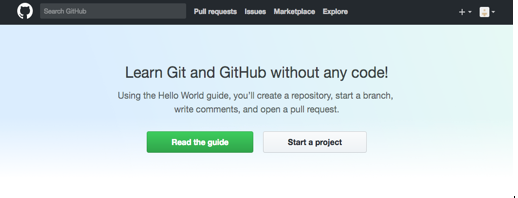

# GitHub Tutorial

_Donia Abdelhalim_

---
## Git vs. GitHub
##### The difference between **Git vs. GitHub**:  
**Git** keeps snapshots/files of your code as a checkpoint of where you are. Having different versions would be useful because you may mess up your code, and you would be able to go back to the any version. Git can also be known as a version control while **Github** would be the host for the repository. This means that the code will be stored. 

_ALSO_:  
**Git** does not require Github, but **GitHub** reguired Git.   
**Github** visually tracks changes, makes collaboration on files easy and most importantly, stores code in the cloud.

---
## Initial Setup

To create a **Github Account** you would start by:  
* Type www.Github.com into the URL or click on [Github](https://github.com/) to be directed 
* On the top right hand corner you will see an icon **Sign in or Sign up**  
* Click **Sign up** or **log on** if you already have an account  
  
* Start by creating your personal account, make sure to include your username, a reachable email and password
* After continuting, click on the continue button again after picking the plan you would like to continue with. 

#### **REMEMBER TO READ ALL DIRECTIONS**  
* To enhance your experience with GitHub, answer a quick survey question as to who you are and submit your results. Don't worry you won't be graded on your experience!
* Make sure you  **Read the Guide** if you are a new user or not!  
 

**NOTE**: you will be directed to a new tab explaining the basic fundementals and power of GitHub

After reading the guidelines, you can head back to the previous tab and **start a project.**    
**You may be asked to confirm your email**  

### How to connect your GitHub to cloud9  
1. Go to www.c9.io to begin 
2. Click on the image of the github "octocat" and sign in with your github account.
3. Once you sign in, you should be directed to your dashboard where you can see your workspaces.  
   **If not, press on "DASHBOARD" at the top of the screen.**
4. Then press the gear icon in the top-right corner of the screen.
5. On the left side, press "SSH Keys" **Make sure you do not copy HTTPS**  
**SSH key:** stands for secure shell and establishes a secure connection between your computer and GitHub (a connection between GitHub and cloud9)
6. Copy the second SSH key.
7. On github, press on your profile picture and click "Settings"
8. Press "SSH and GPG keys" on the left side and then the green button that says "New SSH key".
9. Paste the SSH key under "key" and type "cloud9" as the title.  
10. Click "Add SSH key".  
11. To make sure it is working, go back to your terminal and type `ssh -T git@github.com`. You should see a message that says "Hi <your username>! You've successfully authenticated, but GitHub does not provide shell access."  

 

#### **_You have now finished setting yourself up to use cloud9 and github!_**

How to make a repo:  
1. `cd ~/workspace`
2. `mkdir filename` - makes the directory
3. `cd filename` - goes into your file 
4. `git init` - initalizes git in the directory  

##### **NEVER USE `git init` IN YOUR WORKSPACE**

---
## Repository Setup

`git init`: Initializes git in the repository  

Make sure to first add and commit 
1. `touch README.md`  - create a file 
2. Open `READMe.md`
3. Add text
4. `git add .` - adds the file to the stage

**New repo:**  
1. Go to **Github.com**
2. On the top righthand corner, you should see a "+-". Click on the "+" and click New Repository  
3. You will be asked for a Repository Name and continue
4. You have now made your first repository
 
**Remote: Now your remote is on github**

---
## Workflow & Commands

`git status`: command to see which files have been edited since the last commit and to make sure you are up to date with everything  
`git add`: add the file to the stage to be committed  
`git commit`: takes a 'snapshot' of the files on the stage. The message should be present-tense and describe what was modified in this snapshot  
`git push`: push the committed file back up to the remote

---
## Rolling Back Changes   
To undo any mistakes:   
Undo edit: after you've made an edit, you can undo it using `git checkout -- filename`  
Undo add: after you've added a change, you can undo it using `git reset HEAD filename`  
Undo commit: after you've made a commit, undo it using `git reset --soft HEAD~1` to only undo a commit or `git reset HEAD~1` to undo a commit, add, and edit
Undo push: after you've pushed to the remote undo it using `git reset --hard HEAD~1`

---
## Error handling   

 
* If you mistakenly use `git init` in your workspace, use `rm -rf .git` to go back into workspace first  
* If you are not in workspace, `cd filename` into it
* You must add and commit before you push
* If you have an untracked file when commiting, you most likely didn't use `git add .` before commiting
* If (master) isn't going away in your terminal, use `git init` until you are back in workspace
* If you incorrectly write a code that brings you to the '>', then use Control C to corrupt or end the program

##### REMINDER: ALWAYS USE `git status` TO MAKE SURE YOU AR UP TO DATE

---

## Collaboration  
Intrestingly you are able to ctake someone else's repository, with permission of course, and edit it yourself. The pushes you have made will not effect the original programmer unless you request a pull request and they accept. Lets explain this in simpler terms:
